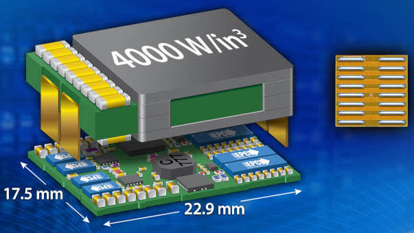
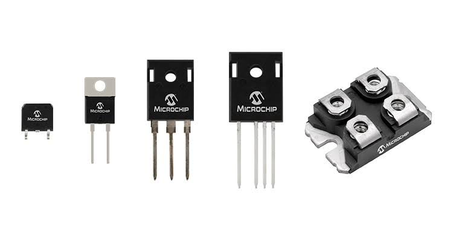
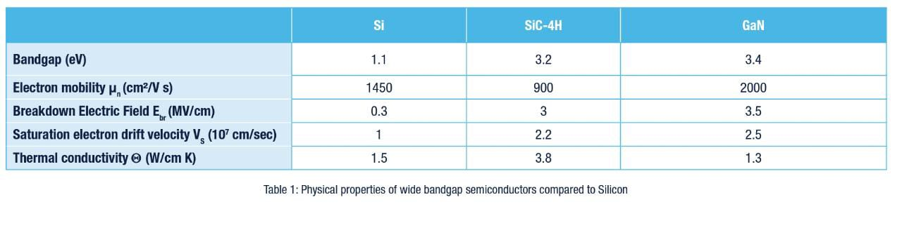
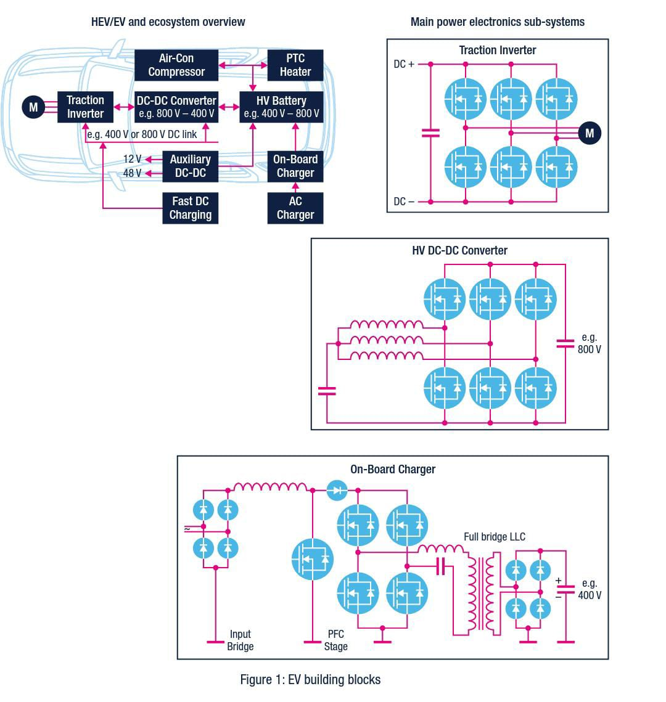
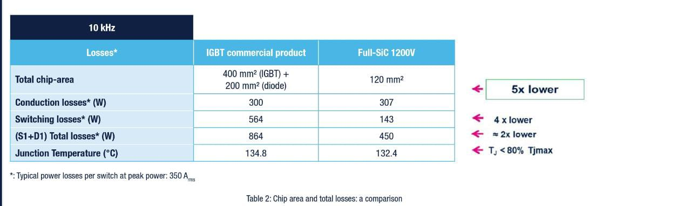
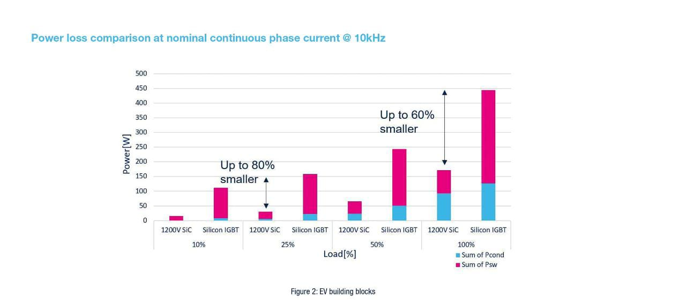
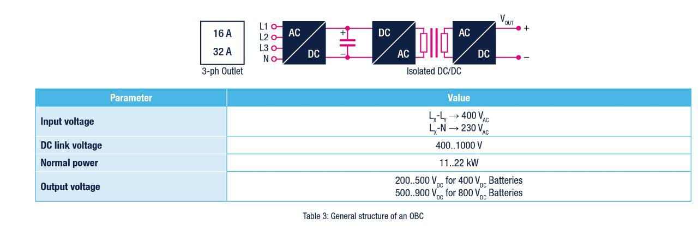
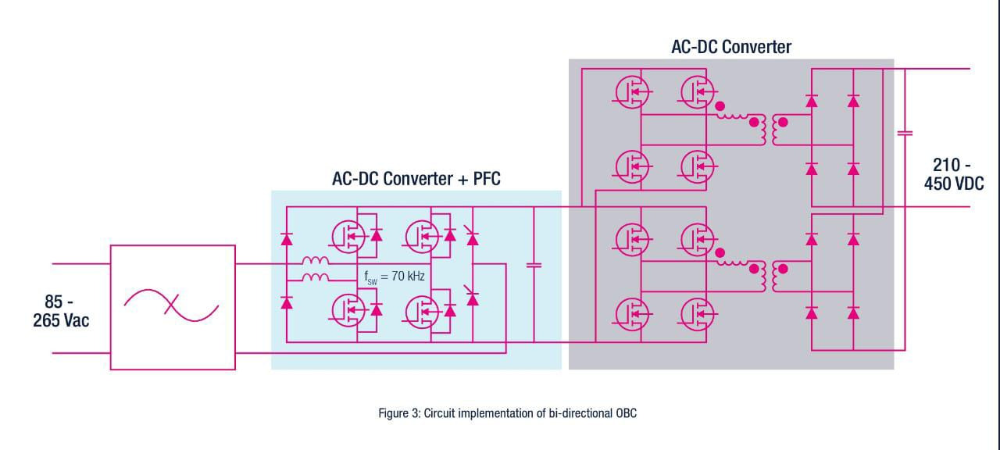
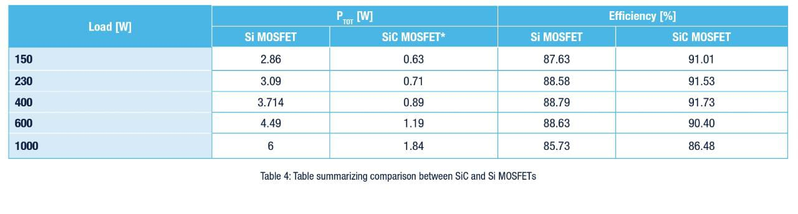
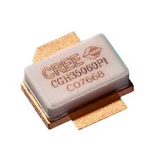

# THE ADVENT OF SILICON CARBIDE PAVES THE WAY FOR LARGE-SCALE ADOPTION OF WIDE BANDGAP SEMICONDUCTORS

GAN device 

SIC device

In power electronics, Silicon (Si) has been adopted as the mainstream technology over the last four decades; today, silicon
power transistors and diodes are so widespread and pervasive that equipment based on this material is closely intertwined
with our everyday lives. This adoption has allowed silicon to enjoy continuous technology and process improvements,
supported by innovative packaging and interconnect technologies, that have enhanced thermal management and reduced
parasitic effects for higher frequency operation. By virtue of this unrelenting quest for improvement, silicon technology is about
to reach a plateau where further iterations can be only incremental. Recently, wide band gap semiconductors have taken over
silicon thanks to their unique properties.
The use of Silicon Carbide (SiC) devices in power electronics has been proposed since the 60s, its wide band-gap and other
features offering the prospect of high efficiency operation. However, some difficulties in manufacturing substrates for SiC
wafers have delayed the development of SiC power devices. The main challenge stymying their adoption has been their cost,
associated with the limited availability of high-quality SiC material, the cost of SiC wafers, and SiC manufacturing problems of
larger wafer diameter, defect densities, and yield. The recent supply of good-quality SiC wafer substrates offered by different
suppliers has helped to circumvent these issues; finally, the increased competition has pushed down wafer prices.
Si SiC-4H GaN
Bandgap (eV) 1.1 3.2 3.4
Electron mobility μn (cm²/V s) 1450 900 2000
Breakdown Electric Field Ebr (MV/cm) 0.3 3 3.5
Saturation electron drift velocity VS (107 cm/sec) 1 2.2 2.5
Thermal conductivity Θ (W/cm K) 1.5 3.8 1.3
Table 1:

## WBG products allow for higher energy conversion efficiency
## SiC has already made inroads into Automotive
## GaN comes next as silicon contender in high-volume applications

In contrast to SiC power devices that have been around for quite a while, Gallium Nitride (GaN) power devices have just started
to appear in the market. GaN offers many of the performance benefits of SiC with the prospect of accrued competitiveness
because it is grown on a larger, lower-cost Si substrate and can be produced in renovated CMOS fabs. However, the
technologies used in SiC and GaN power switches are quite dissimilar. The SiC for instance is a harder material and requires
more sophisticated manufacturing techniques at far higher temperatures with respect to silicon; annealing is done at 1700 °C
and ion implantation at 500 °C vs. 800 °C and 25 °C, respectively.

GaN switches, on the other hand, are derived from RF HEMT (high electron-mobility transistors) technology, which differs from
that of the silicon power FET.

As a key supplier of power solutions, STMicroelectronics has
heightened efforts to complement its offer with wide bandgap
materials (WBG) such as Silicon Carbide (SiC) and Gallium Nitride
(GaN). The two technologies owe their appeal essentially to their
capability to operate at higher voltages without compromising onstate
performance; they can handle far higher temperatures more
safely and can work at higher frequencies. Their physical and
electrical characteristics make it possible to reach unrivalled levels of
miniaturization, reliability and power density, all necessary features in
demanding applications such as electrical-vehicles (EV) inverters and
chargers, datacenter converters and industrial drives, to name just
a few. Environmental concerns so widely debated in the media and
under the spotlight to drive governments’ policies over our energy
future, can therefore be addressed by a large-scale rollout of the
new compound semiconductors. To help you better understand the
potential performance benefits, the following table summarizes the
main properties of silicon vs. SiC (4H polytype) and GaN.

# BENEFITS OF SiC MOSFETS AND GaN HEMTs IN VARIOUS APPLICATIONS

Early efforts to fit SiC technology into stringent automotive requirements by conducting
extensive tests have proved successful for ST, allowing the company to deliver planar SiC
MOSFETs in volume to the electric car industry for the main inverter, DC-DC converter
and OBC. Moreover, STPOWER SiC MOSFETs lend themselves to power charging
stations, the backbone of a global infrastructure. Also, the deployment of silicon carbide
in Automotive not only is helping to address other application areas in the industrial
domain but is also directing designers to conceive future generations for space and
avionic applications.
SiC MOSFETs and GaN HEMTs are largely complementary as each one of them
addresses different applications. EVs are benefiting from large-scale adoption of both,
with SiC MOSFETs and their ability to operate at voltages between 650V and 1600V,
being ideal for traction inverters, DC-DC converters and on-board chargers (OBC).
Operating at voltages from 650V down to 100V, GaN may eventually also be a valuable
technology for the latter two applications, due to its higher frequency capability, as it
becomes more mature and cost effective.
# DESIGN ADVANTAGES OF USING SiC MOSFETs
In spite of its being a new material still subject to deep investigations, ST has successfully proposed the SiC technology for
EV applications, therefore contributing to stepping up car electrification. We can thus quantify the benefits of a SiC MOSFET
by considering a 210kW inverter and compare it against a silicon solution like an IGBT (plus freewheeling diodes) in terms of
total chip area and losses. Realistically we are assuming 10kHz operation and 800V bus that is becoming the main choice for
car makers. The following figure shows the main EV blocks; the OBC and the DC-DC converter can also benefit from using SiC
MOSFETs whereas Table 2 summarizes total losses and chip area when using a silicon IGBT and a SiC MOSFET.

Depending upon the load, the gain in efficiency varies from 3 to 8%. Even more impressive, it achieves this better efficiency in
chips that are 5 times smaller

Figure 2 depicts the losses split, between conduction and switching, as a function of load. Overall, by virtue of the drastic
reduction in losses, the size of the PCU (power control unit) can be reduced by 50% which in turn enables a cost reduction of
the cooling system.

# Power loss comparison at nominal continuous phase current @ 10kHz

Another interesting evaluation involves the use of SiC MOSFETs in a bi-directional OBC.

A circuit implementation of a bi-directional OBC is indicated in Table 4 where the SiC MOSFET in this case is benchmarked to
a silicon super-junction MOSFET. This topology has a very important feature in that high-voltage batteries can also be charged
by the 12V battery thanks to the reverse flow of energy.

# BENEFITS OF USING GaN DEVICES AND THEIR FUTURE POTENTIAL

GaN HEMTs are starting to make inroads into a wide range of applications such as OBC,
wireless charging, point-of-loads (POL), photovoltaic micro-inverters, switching power
supplies and adaptors, etc., exploiting their superior performance in terms of low onresistance,
low capacitances and gate charge, therefore high operating frequencies. This
is also possible considering the voltage range they can cover which extends from 100V
to 650V/900V. In so doing they will help designers achieve higher conversion efficiencies,
smaller form factors and therefore push power density up to reach new challenging and
unrivalled targets.
Owing to such properties, not only traditional topologies deliver superior performance,
but also new circuit concepts are being enabled by their use. For instance, an efficiency
of 99% can be reached in totem-pole PFC circuits providing high efficiency and increased
power density. Generally, bridgeless PFC has lower on-losses than traditional PFC by
virtue of a reduced number of active semiconductor devices from three to two. A totempole
bridgeless topology is also used because of its lower EMI noise with respect to other
bridgeless topologies.
Another example of a high-volume application benefiting from GaN usage is the Active
Clamp Flyback (ACF) converter employed in PC travel adaptors and USB wall chargers.
In this topology (Figure 5), the standard diode of a conventional flyback circuit can
be replaced by a secondary switch (S2). Thanks to low switching losses (zero voltage
switching) and the transformer’s leakage energy re-utilization, it can be used at high
frequencies reducing adaptors’ size and weight significantly.

 # CONCLUSION
Power electronics designers have been waiting for breakthrough technologies in order to reshuffle circuit topologies and boost
efficiency in energy conversion systems. The SiC technology perfectly matches these expectations. The time is over when
people tinkered with silicon carbide as a naïve technology to be tested in labs. Today ST is producing SiC MOSFETs and
diodes in very large volumes suiting a large spectrum of applications. We are currently helping many customers develop their
future applications who appreciate the very significant potential of these innovations. A new era marked by the Nth revolution
is ahead of us.

 # courtesy
STMicroelectronics